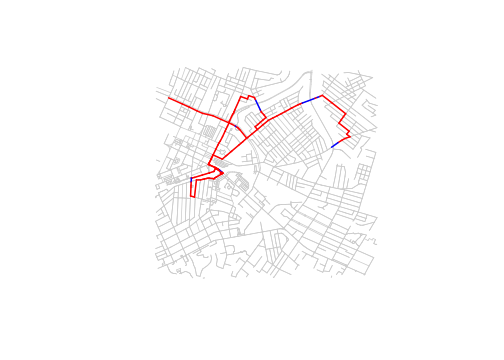

<!-- README.md is generated from README.Rmd. Please edit that file -->

# pathfinder

[](https://travis-ci.org/dSHARP-CMU/pathfinder)
[](https://codecov.io/github/dSHARP-CMU/pathfinder?branch=master)

The goal of pathfinder is to find a path across multiple edge bundles in
a graph that minimizes the number of times each bundle is traversed.

## Installation

You can install the development version:

``` r
devtools::install_github("dSHARP-CMU/pathfinder")
```

## Usage

Starting with an igraph object, specify edge bundles that must be
traversed by using a list of edge indices:

``` r
# A small subset of road data from Pittsburgh
pgh_graph
#> IGRAPH 6aae588 DN-- 2370 5272 -- 
#> + attr: name (v/c), lat (v/n), lon (v/n), label (v/c), component
#> | (v/n), is_interface (v/l), name (e/c), access (e/c), bridge
#> | (e/c), bridge_name (e/c), highway (e/c), label (e/c), oneway
#> | (e/c), bridge_relation (e/c), is_bridge (e/l), bridge_id (e/c),
#> | distance (e/n), within_boundaries (e/l), .id (e/n)
#> + edges from 6aae588 (vertex names):
#>  [1] 572065243->104186779 572065243->572065248 572065243->104186789
#>  [4] 104186779->572065243 104186779->104186773 104186779->104690428
#>  [7] 104186773->104186779 104186773->104186765 104186773->105931733
#> [10] 104186765->104186773 104186765->104704862 104377324->104377338
#> + ... omitted several edges

pgh_distances
#>  [1]  72.08518 175.88835  17.91567  72.08518  48.69814 127.00927  48.69814
#>  [8] 124.12945  53.53418 124.12945 174.14106  38.01624 160.20430  49.83045
#> [15]  38.01624  41.57279 113.03313  41.57279  46.55268 152.57064
#>  [ reached getOption("max.print") -- omitted 5252 entries ]

# Edges belonging to Pittsburgh bridges
pgh_bundles
#> [[1]]
#> [1] 1514 2847
#> 
#> [[2]]
#> [1] 2252 3112
#> 
#> [[3]]
#> [1] 2815 2836 2837 2838
#> 
#> [[4]]
#> [1] 2853 2855 2856 3105
#> 
#> [[5]]
#> [1] 3055 3095
#> 
#> [[6]]
#> [1] 3685 3686
```

`greedy_search()` will traverse the graph by walking a path from the
starting vertex to the nearest edge bundle, crossing that bundle, then
finding the next closest bundle, until all bundles have been crossed at
least once. By setting `penalize = TRUE` you can add a severe edge
weight penalty to crossed bundles to discourage crossing bundles more
than once.

``` r
penalized_run <- greedy_search(pgh_graph, 
                               edge_bundles = pgh_bundles, 
                               distances = pgh_distances, 
                               penalize = TRUE)
```



It’s also possible to supply penalty functions that will completely
prohibit recrossing edge bundles, however this may result in incomplete
paths that get trapped.

``` r
infinite_run <- greedy_search(pgh_graph, 
                              edge_bundles = pgh_bundles, 
                              distances = pgh_distances, 
                              penalize = TRUE, 
                              penalty_fun = penalize_inf)
#> Warning in greedy_search_handler(pathfinder_graph = pathfinder_graph, starting_point = starting_point, : Not all points reachable. Stopped early.
```

Tidying methods are also available to get summary statistics on
resulting pathways at different levels of resolution.

``` r
augment(penalized_run)
#> # A tibble: 160 x 7
#> # Groups:   edge_id [148]
#>    index step_id edge_id bundle_id cheated_path times_edge_cros…
#>    <int>   <int>   <int>     <int> <lgl>                   <int>
#>  1     1       1       2        NA FALSE                       1
#>  2     2       1     542        NA FALSE                       1
#>  3     3       1     879        NA FALSE                       1
#>  4     4       1    2678        NA FALSE                       1
#>  5     5       1    2166        NA FALSE                       1
#>  6     6       1    2949        NA FALSE                       1
#>  7     7       1    5232        NA FALSE                       1
#>  8     8       1     330        NA FALSE                       1
#>  9     9       1    2473        NA FALSE                       1
#> 10    10       1    4139        NA FALSE                       1
#> # … with 150 more rows, and 1 more variable: times_bundle_crossed <int>
```

For more info, see `?glance`, `?tidy`, `?augment`

## Context

This package is one of several originally developed by [Matthew
Lincoln](https://github.com/mdlincoln) for use by Carnegie Mellon
University’s [“Bridges of Pittsburgh”](http://bridgesofpittsburgh.net/)
project:

  - [konigsberger](https://dsharp-cmu.github.io/konigsbergr/index.html)
    (end-user package)
      - [pathfinder](https://github.com/dSHARP-CMU/pathfinder/)
      - [bigosm](https://github.com/dSHARP-CMU/bigosm)
      - [simplygraph](https://github.com/dSHARP-CMU/simplygraph)
